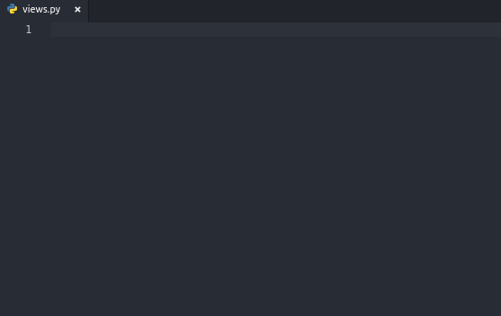

If you are like me, you have dropped your other editors and IDEs for VS Code. I have been using VS Code as my primary editor for about a year now. My goal is to balance the bare minimum with the most efficient plugins. The last thing we want to do is turn VS Code into Intellij, right? Here are my top plugins and configurations.

## [Python](https://marketplace.visualstudio.com/items?itemName=ms-python.python)

This plugin is essential. It provides a plethora of features for working with Python files. If you have ever worked with Python in VS Code you probably already have it installed!

## [Importmagic](https://marketplace.visualstudio.com/items?itemName=brainfit.vscode-importmagic)

This is a plugin whose features I think will eventually be part of VS Code core. I do not like typing imports manually as there is a lot of room for error. This gives you that Java/Intellij style auto importing that we all love. Let’s be honest, no one can remember in which module the class you want to instantiate is in. For those of you coming from big IDEs, you will be missing your auto-imports until you install this one.

## [autoDocstring](https://marketplace.visualstudio.com/items?itemName=njpwerner.autodocstring)

Probably the most underrated of the Python plugins — autoDocstring makes writing doc strings a breeze, and who doesn’t like docstrings? It is configurable for all the most popular docstring formats like Google, Sphinx, and others.

## [SQLite](https://marketplace.visualstudio.com/items?itemName=alexcvzz.vscode-sqlite)

SQLite – everyone’s favorite database. It deserves a proper database viewer inside VS Code. This plugin is very lightweight and is great to have when working on your Django apps.

## [Vim](https://marketplace.visualstudio.com/items?itemName=vscodevim.vim)

This one is totally preference! I like editing using vim keybinds. I feel like I have more control, and its easier to navigate files. However, if you have never used Vim before, then take some time to learn about it and try it out somewhere else before bringing it into your editor. However, I must add that I often toggle Vim off in VS Code when I want, and then turn it back on when I am ready to start coding.

## [GitLens](https://marketplace.visualstudio.com/items?itemName=eamodio.gitlens)

Not unique for Python development, but all of my code is checked into Git making this a no-brainer choice. Some people like to turn off the Blame features because they feel as if it clutters the file. I personally do not mind them, but to each their own.

## [One Dark Pro](https://marketplace.visualstudio.com/items?itemName=zhuangtongfa.Material-theme)

The one thing that Atom is unquestionably better than VS Code at is it’s dark theme. This theme is so nice on the eyes. Personally, I think it’s the best color scheme and I hope that all of the software that I use incorporates these dark pastel shades in one form or another.

## [Django](https://marketplace.visualstudio.com/items?itemName=batisteo.vscode-django)

A must-have for Django developers out there. It is especially useful if you do any server side rendering using Django templates, or even Email templates. It will provide syntax highlighting and snippets. Add a rule to your settings, or Ctrl + K M and select Django-html.

## Settings

I like to keep my settings pretty lean, but there are also a few essential flags to set to make your life much easier! Here are some I like:

```json
{
  "editor.formatOnSave": true,
  "editor.minimap.enabled": false,
  "files.autoSave": "afterDelay",
  "files.autoSaveDelay": 500,
  "autoDocstring.docstringFormat": "google",
  "editor.snippetSuggestions": "top"
  "files.watcherExclude": {
    "**/.git/objects/**": true,
    "**/.git/subtree-cache/**": true,
    "**/node_modules/**": true,
    "**/.direnv/**": true,
    "**/.venv/**": true
  }
}
```

Thanks for reading! And happy hacking!
